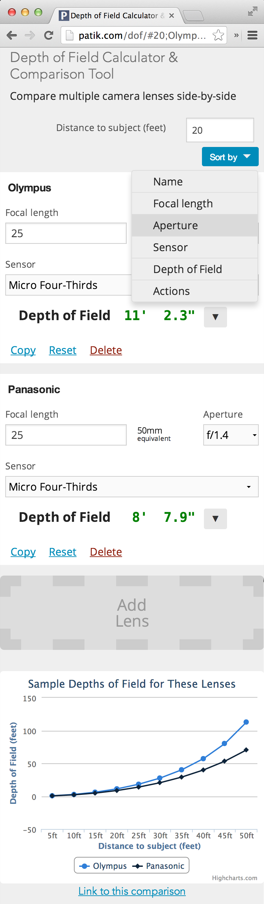

# [Depth of Field Calculator](http://patik.com/dof/)

Calculate the depth of field for multiple lenses and compare them side-by-side

**[Try it](http://patik.com/dof/)**

## Mobile view

**[Try it](http://patik.com/dof/)**

[Documentation](http://patik.com/dof/about/)
