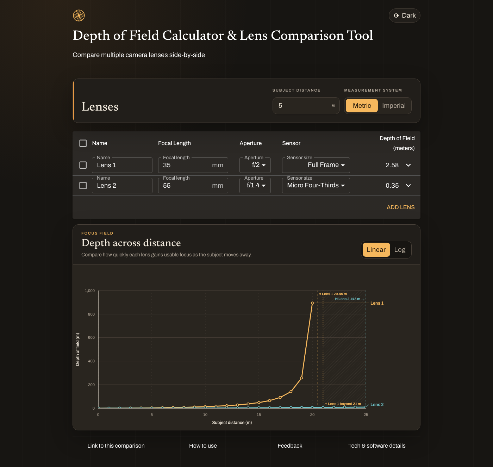

# Depth of Field Calculator

[](https://github.com/patik/dof/actions/workflows/ci.yml)
[](https://www.npmjs.com/package/dof)
[](https://patik.com/dof/)
[](LICENSE)

Compare how focal length, aperture, sensor size, and subject distance change the depth of field. The calculator keeps multiple lenses side by side, turns the same calculations into an interactive distance chart, and packages the underlying math as the zero-dependency [`dof`](https://www.npmjs.com/package/dof) library.

**[Open the calculator →](https://patik.com/dof/)**

[](https://patik.com/dof/)

## Features

- Compare any number of lenses with metric or imperial measurements.
- See near limit, far limit, hyperfocal distance, circle of confusion, and total depth of field.
- Explore a continuous distance chart with linear and logarithmic views, hyperfocal markers, infinity regions, and precise pointer readouts.
- Share a comparison with a compact permalink and keep local edits between visits.
- Install the calculator as an offline-capable PWA.
- Use the same calculation engine from JavaScript or TypeScript through the [`dof` package](package/README.md).

## Stack

The app uses React 19, Vite, TanStack Router, Tailwind CSS, Material UI, Zustand, and a custom SVG chart built from focused d3 modules. The library is bundled as ESM with tsdown. Bun manages the workspace, Vitest covers calculations and chart logic, and Playwright covers browser behavior, accessibility, visuals, and offline use.

### Decisions and why

- **Custom SVG chart:** one purpose-built chart is smaller and easier to shape than a general visualization framework while keeping the geometry testable.
- **Static Vite app + PWA:** the calculator needs fast client interaction and reliable offline access, not a runtime server.
- **ESM-only library:** v4 has one modern package contract, an explicit exports map, and no runtime dependencies. Node 20.19+ can also load ESM from CommonJS with `require(esm)`.
- **Changesets releases:** version intent travels with each change, while the release PR, npm provenance, and GitHub Release stay automated and reviewable.

The modernization sequence and its tradeoffs are tracked in [the 2026 roadmap](https://github.com/patik/dof/issues/510).

## Development

Requires [Bun](https://bun.sh/) 1.3.14 and Node.js 24 for the complete toolchain.

```sh
git clone https://github.com/patik/dof.git
cd dof
bun install --frozen-lockfile
bun run dev
```

Useful commands:

```sh
bun run lint       # Biome, TypeScript, and Knip
bun run test       # package build plus all Vitest projects
bun run e2e        # Playwright browser suite
bun run build      # package and production app
```

Library installation and API documentation live in [package/README.md](package/README.md), which is also the README published to npm.
